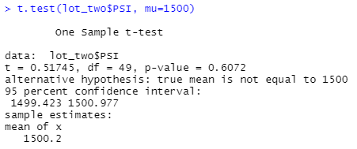

# MechaCar_Statistical_Analysis

MechaCar!!! The car of the future is now!... just as soon as some production troubles are sorted out.

The company AutosRUs' has requested that my team and I do an analysis on MechaCar's potential MPG. As well as collect a statistical analysis on the suspension coils PSI. Then do an analysis on how the MechaCar might compare to competitor designs.

## Linear Regression Model

1. Which variables/coefficients provided a non-random amount of variance to the MPG values in the dataset?

Given the result of our data, I would say that vehicle length and ground clearance show a non-random statistical variance to the MPG values.

2. Is the slope of the linear model considered to be zero? Why or why not?

The slope of the linear model can't be considered zero. If you look at the coefficients table and then look at the p-values, you can see that both vehicle length (2.60e-12) and ground clearance (5.21e-08) are above zero. Which means that these two variables impact MPG.

3. Does this linear model predict mpg of MechaCar prototypes effectively? Why or why not?

I don't believe that the dataset given to me provides enough information to effectively predict the MPG of the MechaCar. Only two of the variables show a relationship to MPG. There must be more variables that could help give me insight.

## Summary Statistics on Suspension Coils

Question: The design specifications for the MechaCar suspension coils dictate that the variance of the suspension coils must not exceed 100 pounds per square inch. Does the current manufacturing data meet this design specification for all manufacturing lots in total and each lot individually? Why or why not?

Looking at the total lot, I would say that overall the design meets the requirement for the suspension coils. However, even looking at the total lot, you can see that there is a difference in the datasets since the mean and the median are different. Once we break the analysis down to each individual lot, we can see that there is an issue with lot three. The variance for lot three is 170, which means that's the variable impacting our total lot analysis.

# Total Summary

# Individual Lot Summary

## T-Tests on Suspension Coils

Lot one, the mean is 1500. Which means the suspension coils are within standards.

Lot two, the mean is 1500.2. Which means the suspension coils are within standards.

Lot three has a mean of 1496.14, which is 4 PSI below the requirement for the suspension coils. The p-value is also at 0.042, which is significantly lower that lot one (1) and lot two (0.61). Lot three shouldn't be used in the design of the MechaCar, or at least needs to be addressed and fixed.

## Study Design: MechaCar vs Competition

There's numerous ways to compare a car to it's competition. Some of these ways include the cost of the car, city or highway fuel efficiency, horse power, maintenance cost, or safety rating. Everyone drives their car differently. Some people are easy on their car, meanwhile others can be incredibly rough on their car and push it to it's limits fighting crime in Gotham City. I believe focusing on maintence costs would provide a well rounded analysis. Which parts of the car are breaking and how often? How many miles are users getting out of before a certain section of the car starts having issues? Consumers are more than happy to pay for a more expensive car that has all the bells and whistles. Consumers aren't happy to pay for an expensive car that breaks down more often than cars that cost a similar value or even less. Since we'd be looking at different categories within the MechaCar's system, we'd want to use a Chi-Squared Test. We'd be using our observed results of how the MechaCar performs and compare that to the expected results of the cars that are already on the market. 

